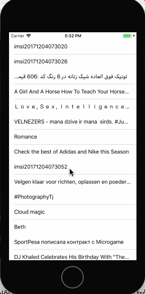

# HLT assignment - Flickrable

**Flickrable** is a reduce app using [The Flickr Database API](https://www.flickr.com/services/api/).

Time spent: **16** hours spent in total

## User Stories

The following functionality is completed:

- [x] User can view a list of photos recently showing. Post's images load asynchronously.
- [x] User can view photo details by tapping on a cell.
- [x] User can pull to refresh the movie list.
- [x] All images fade in.

## Technical things
- Using RxSwift to handle asynchronous events and data driven.
- Using MVVM architecture.

## Video Walkthrough

Here's a walkthrough of implemented user stories:

GIF created with [LiceCap](http://www.cockos.com/licecap/).

## Notes

Describe any challenges encountered while building the app.

## License

Copyright [2017] [Tri Ngo Minh]

Licensed under the Apache License, Version 2.0 (the "License");
you may not use this file except in compliance with the License.
You may obtain a copy of the License at

http://www.apache.org/licenses/LICENSE-2.0

Unless required by applicable law or agreed to in writing, software
distributed under the License is distributed on an "AS IS" BASIS,
WITHOUT WARRANTIES OR CONDITIONS OF ANY KIND, either express or implied.
See the License for the specific language governing permissions and
limitations under the License.